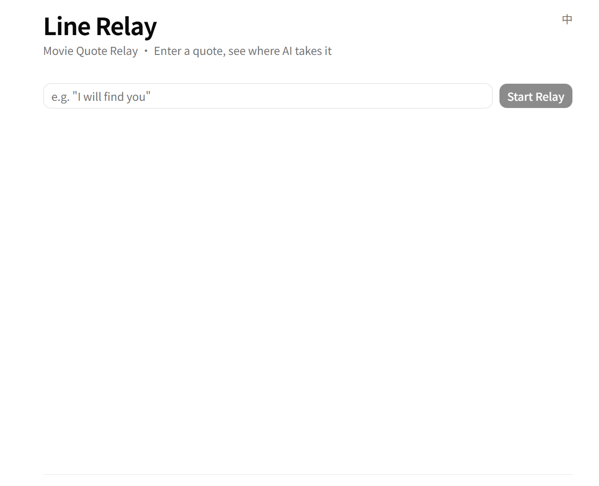

# Line Relay - AI Movie Quote Relay Generator | AI台词接龙视频生成器

[](https://github.com/KeitouYa/line-relay/actions/workflows/ci.yml)
[](https://line-relay-vert.vercel.app)

Input a movie quote, and AI automatically generates a hilarious quote relay conversation. | 输入一句电影台词，AI自动生成搞笑台词接龙视频。

**🌐 Try it live:** [line-relay-vert.vercel.app](https://line-relay-vert.vercel.app)

## Demo



Type any quote, get a 6-line relay across films — keyword pivots, tonal twists, and absurd jumps, ranked by an LLM judge.

## Quick Start | 快速启动

```bash
# 1. Copy environment variables | 复制环境变量
cp .env.example .env
# Edit .env and fill in your API keys | 编辑 .env，填入你的 API keys

# 2. Start all services | 启动所有服务
docker compose up --build

# 3. Access | 访问
# Frontend | 前端: http://localhost:3000
# API Docs | 后端API文档: http://localhost:8000/docs
# Health Check | 健康检查: http://localhost:8000/health
# MinIO Console | MinIO管理界面: http://localhost:9001
```

## Tech Stack | 技术栈

- **Frontend | 前端**: Next.js 15 + React 19 + shadcn/ui + Tailwind CSS
- **Backend | 后端**: Python + FastAPI
- **Task Queue | 任务队列**: Celery + Redis
- **Database | 数据库**: PostgreSQL + Pgvector
- **Cache | 缓存**: Redis
- **LLM**: DeepSeek (via LangChain)
- **Embedding**: Gemini Embedding API
- **Video Processing | 视频处理**: FFmpeg
- **Object Storage | 对象存储**: MinIO (dev | 开发) / AWS S3 (prod | 生产)
- **Containerization | 容器化**: Docker Compose
